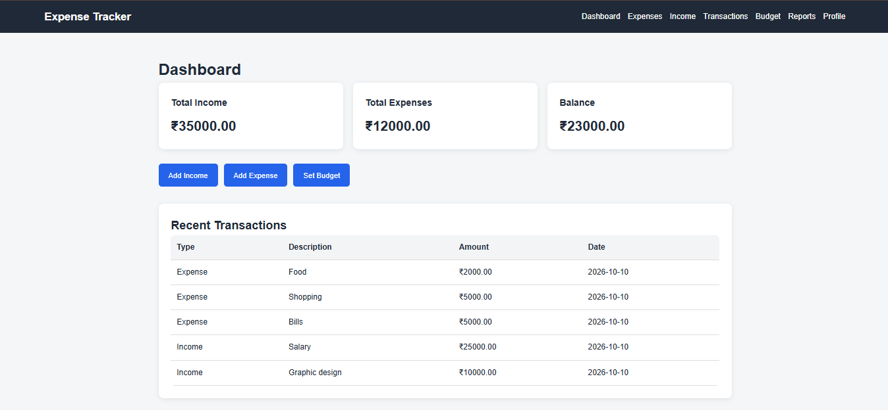
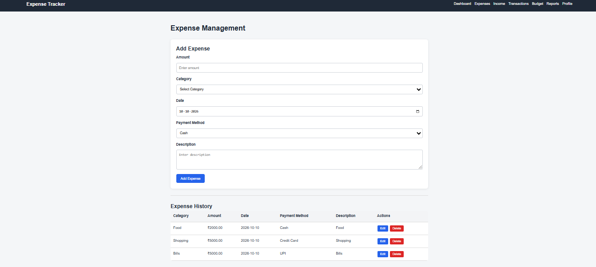
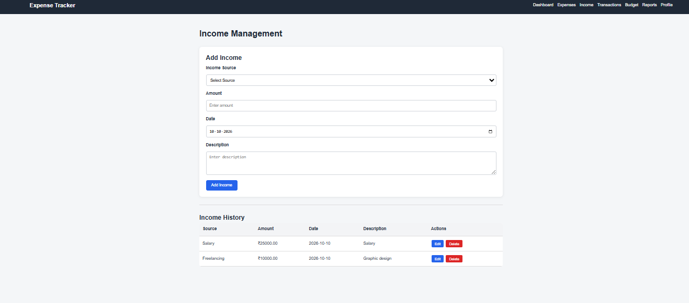
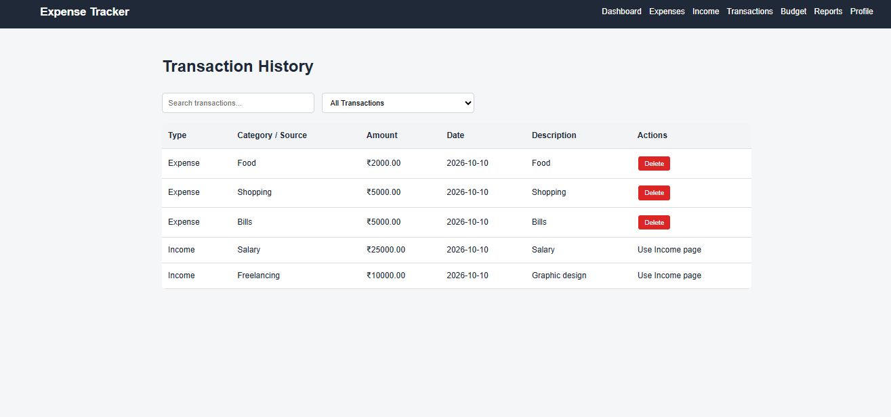
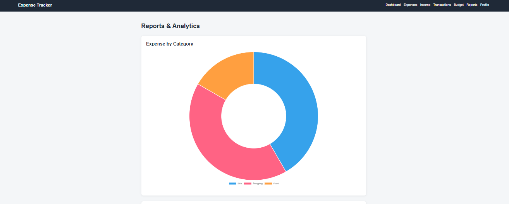

# Expense Tracker Web Application

A full-stack Expense Tracker web application developed using HTML, CSS, JavaScript, PHP, and MySQL.

The application allows users to manage income and expenses, set monthly budgets, view transactions, and analyze financial data through reports and charts.

## Table of Contents

- [Project Status](#project-status)
- [Features](#features)
- [Technologies Used](#technologies-used)
- [Prerequisites](#prerequisites)
- [Project Modules](#project-modules)
- [Database Tables](#database-tables)
- [Screenshots](#screenshots)
- [Project Structure](#project-structure)
- [How to Run Locally](#how-to-run-locally)
- [Security](#security)
- [Key Learnings](#key-learnings)
- [Future Improvements](#future-improvements)
- [Project Links](#project-links)
- [Author](#author)

## Project Status

**Completed and tested locally.**

The application has been tested locally for database integration, income and expense management, and user authentication.

## Features

- User Registration
- User Login and Logout
- Session-Based Authentication
- Financial Dashboard
- Add, View, Edit, and Delete Expenses
- Add, View, Edit, and Delete Income
- Transaction Management
- Monthly Budget Management
- Expense and Income Reports
- Expense Category Analysis
- Monthly Expense Analysis
- User Profile Management
- MySQL Database Integration

## Technologies Used

### Frontend
- HTML5
- CSS3
- JavaScript

### Backend
- PHP

### Database
- MySQL

### Development Tools
- Visual Studio Code
- XAMPP
- Apache
- MySQL Workbench
- phpMyAdmin
- Git and GitHub

### Libraries
- Chart.js

## Prerequisites

Before running the application, ensure you have:

- XAMPP with Apache and PHP
- MySQL Server
- A web browser
- Visual Studio Code or another code editor (optional)
- The project files downloaded or cloned from GitHub

## Project Modules

### 1. Registration
Allows new users to create an account.

### 2. Login
Authenticates users using their email and password.

### 3. Dashboard
Displays financial summaries, including total income, total expenses, balance, and recent transactions.

### 4. Expense Management
Allows users to add, view, edit, and delete expense records.

### 5. Income Management
Allows users to add, view, edit, and delete income records.

### 6. Transactions
Displays income and expense transactions together with search and filtering options.

### 7. Budget Management
Allows users to manage monthly budgets and compare budgets with expenses.

### 8. Reports and Analytics
Provides graphical analysis of income and expenses using Chart.js.

### 9. Profile
Displays the logged-in user's profile information.

### 10. Logout
Ends the user's PHP session.

## Database Tables

The application uses the following MySQL tables:

| Table | Purpose |
|---|---|
| `users` | Stores user account and authentication information. |
| `expenses` | Stores users' expense records. |
| `income` | Stores users' income records. |
| `budgets` | Stores monthly budget information. |

## Screenshots

### Dashboard


### Expense Management


### Income Management


### Transactions


### Reports and Analytics


## Project Structure

```text
Expense-Tracker/
├── css/
│   ├── dashboard.css
│   ├── login.css
│   └── style.css
├── js/
│   ├── budget.js
│   ├── dashboard.js
│   ├── expenses.js
│   ├── income.js
│   ├── login.js
│   ├── profile.js
│   ├── register.js
│   ├── reports.js
│   └── transactions.js
├── php/
│   ├── add_budget.php
│   ├── add_expense.php
│   ├── add_income.php
│   ├── db.php
│   ├── db_config.example.php
│   ├── delete_expense.php
│   ├── delete_income.php
│   ├── get_budget.php
│   ├── get_expenses.php
│   ├── get_income.php
│   ├── get_profile.php
│   ├── get_reports.php
│   ├── login.php
│   ├── logout.php
│   ├── register.php
│   ├── test_connection.php
│   ├── update_expense.php
│   └── update_income.php
├── screenshots/
│   ├── dashboard.png
│   ├── expenses.png
│   ├── income.png
│   ├── transactions.png
│   └── reports.png
├── .gitignore
├── budget.html
├── dashboard.html
├── database.sql
├── expenses.html
├── income.html
├── index.html
├── login.html
├── profile.html
├── register.html
├── reports.html
├── transactions.html
└── README.md
```

## How to Run Locally

### 1. Install and Start XAMPP

Install XAMPP with Apache and PHP.

Start Apache from the XAMPP Control Panel. Ensure your MySQL server is running. If you use a separate MySQL service, make sure you connect to the correct server and port.

### 2. Download the Project

Clone the repository:

```bash
git clone https://github.com/Zubiyakhan27/Expense-Tracker-Web-App.git
```

Alternatively, download the repository as a ZIP file and extract it.

### 3. Place the Project in `htdocs`

Copy the project folder into your XAMPP `htdocs` directory.

Example:

```text
C:\xampp\htdocs\Expense-Tracker
```

Ensure the project files are directly inside this folder.

### 4. Create the Database

1. Open `http://localhost/phpmyadmin`.
2. Create a database named `expense_tracker`.
3. Select the `expense_tracker` database.
4. Open the **Import** tab and import the project's `database.sql` file.
5. Confirm that the `users`, `expenses`, `income`, and `budgets` tables have been created.

### 5. Configure Database Credentials

1. Open the project's `php` folder.
2. Copy `db_config.example.php`.
3. Rename the copy to `db_config.php`.
4. Open `db_config.php` and enter your local MySQL host, username, password, and database name.
5. Ensure the variable names match those used by `php/db.php`.

Example configuration structure:

```php
<?php

$host = "localhost";
$username = "your_local_username";
$password = "your_local_password";
$database = "expense_tracker";

?>
```

Replace the example values with your own local database credentials. Do not use real credentials in this README.

### 6. Open the Application

Open your browser and visit:

```text
http://localhost/Expense-Tracker/
```

Register an account and log in to access the application.

## Security

- Real database credentials are stored in the local `php/db_config.php` file.
- The real configuration file is excluded from Git using `.gitignore`.
- `php/db_config.example.php` provides a template without real credentials.
- Never commit or upload `php/db_config.php` to GitHub.
- Do not store passwords or other sensitive credentials in source code or screenshots.

## Key Learnings

Through this project, I practised:

- Building web pages with HTML, CSS, and JavaScript.
- Connecting PHP backend endpoints to a MySQL database.
- Performing CRUD operations (Create, Read, Update, and Delete).
- Implementing registration, login, and session-based authentication.
- Managing relational database tables.
- Creating reports and charts using Chart.js.
- Using Git and GitHub for source code management.
- Configuring and testing a local development environment using XAMPP.

## Future Improvements

- Improve responsive design for mobile and tablet screens.
- Add expense export to CSV or PDF.
- Add budget alerts and spending notifications.
- Improve server-side validation and error handling.
- Add password reset functionality.
- Deploy the application to a secure hosting environment.

## Project Links

- **GitHub Repository:** [Expense Tracker Web Application](https://github.com/Zubiyakhan27/Expense-Tracker-Web-App)
- **Live Demo:** Not currently deployed; the application runs locally.

## Author

**Zubiya Khan**

BCA Student | Aspiring Software Developer | Web Development | Data Analytics
